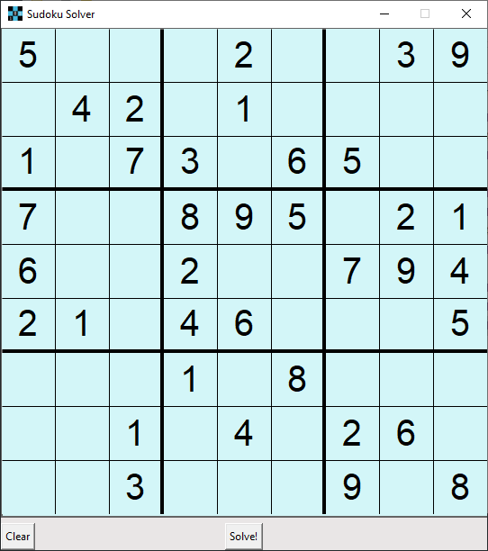
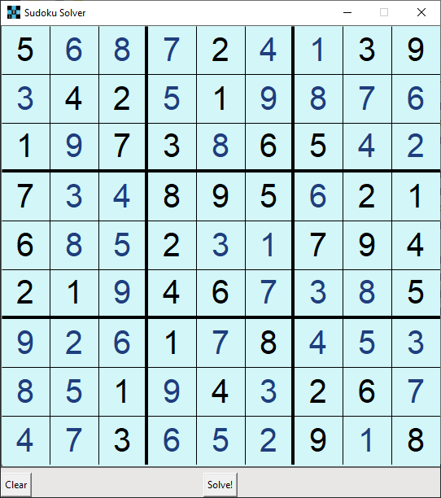

Simple sudoku solver. Includes a GUI done in Python with Tkinter.


Simply compile everything into a single executable Solver.exe, an example of this can be seen:

```
g++ Matrix.hpp Board.cpp Solver.cpp -o Solver
```

When executed, it will read from file `sudoku.dat` and generate a `solved.dat` with the solution.
Sudokus are represented as a 81 character string. 0 represents empty and numbers from 1-9 row by row.

For running the GUI, simply execute UI.py and input a sudoku and hit solve. (While making sure Solver.exe is already compiled, and in the same folder)

For example: <br>


This unsolved sudoku, can be represented in `sudoku.dat` as simply the following string:
`500020039042010000107306500700895021600200794210460005000108000001040260003000908`

When the _Solve!_ button is clicked, or `Solver.exe` executed it yields the full result in `solved.dat` as follows:

`568724139342519876197386542734895621685231794219467385926178453851943267473652918`

This can be better visualized in the GUI as displayed:



It was originally intented for windows, but it should have no problems being executed on unix-like systems.

This was done as a project for my data structures and algorithms class in late 2019.
Simply uploading for future reference.

Feel free to use this in any way you may find useful.

